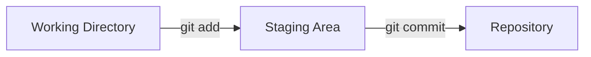

<h1 align="center">Part 1</h1>

<h3>A Quick High-Level Conceptual Overview </h3>

* Repository :
	> A Git "Repo" is a workspace which tracks and manages files within a folder.
	Anytime we want to use Git with a project, app, etc we need to create a new git repository. We can have as many repos on our machine as needed, all with separate histories and contents.

* Committing
	> Making a commit is similar to making a save in a video game.  We're taking a snapshot of a git repository in time.
	   When saving a file, we are saving the state of a single file.  With Git, we can save the state of multiple files and folders together.

* Adding
	> It's a way of telling Git, "please include this change in our next commit".

<h3>The Basic Git Workflow</h3>

| Work on stuff | Add changes | Commit |
|:-------------:|:-----------:|:------:|
| Make new files, edit files, delete files, etc | Group specific changes together, in preparation of committing | Commit everything that was previously added |

