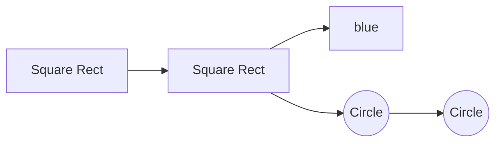

<h1 align="center">Part 1</h1>

<h3>Merging Branches</h3>

Branching makes it super easy to work within self-contained contexts, but often we want to incorporate changes from one branch into another! We can do this using the git merge command.

- We merge branches, not specific commits
- We always merge to the current HEAD branch

```cosole
git switch <destination-branch>
git merge <source-branch>
```

> Note: Merging does not delete any branches and only merges or changes the contents of the branches.

merge has two types:

1. **Fast-Forward**
	In this type of merging, the branch we want to merge with the second or main branch. It is a branch whose origin is the last commit on the main branch and contains all the contents of the main branch. In a way, it can be said that the main branch has not changed after the separation of this sub-branch and all the changes in the sub-branches have happened.

	```mermaid
	graph LR
	A[32ff..] --> B[43fd..]
	X{HEAD} -- master --> B
	B --> C((16td..))
	C --> D((34kj..))
	Y{HEAD} -- bug-fix --> D
	```

	In fact, after merging all the commits of the new branch are transferred to the commits of the main branch or copied in some way. After merging, both of these branches refer to one commit and the history of the commits is the same, but don't forget that the new branch is still not destroyed and is only merged, and every new change in the new branch after merging is not applied to the main branch.

	```mermaid
	graph LR
	A[32ff..] --> B[43fd..]
	B --> C[16td..]
	C --> D[34kj..]
	X{HEAD} -- master,bug-fix --> D
	```
	

